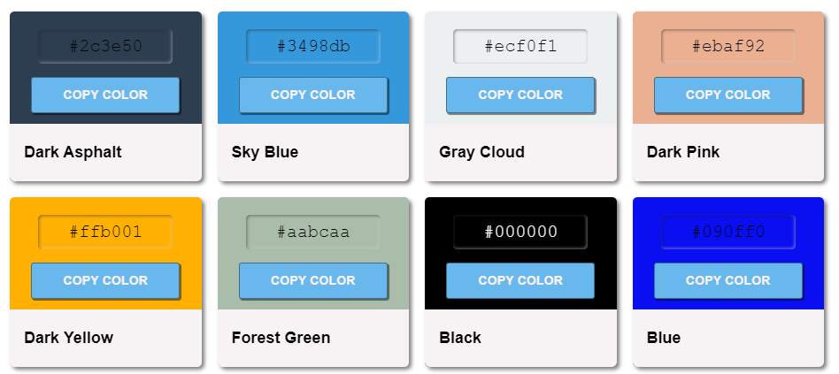

# Color Palette 

Color palette is a simple tool, in which you can copy the hexadecimal color, to be used in any project.

On the internet, you can get this type of more sophisticated tools, this is a practice project, taken from YouTube channel _dcode_, in which knowledge of web technologies is strengthened, such as: __HTML__, __CSS__ and __JavaScript__.

## Technologies

- HTML
- CSS
- JavaScript

## Development Environment

- VS Code

## Project Structure

```
└── 📁color-palette
    └── 📁assets
        └── 📁images
            └── old-image.png
        └── 📁sound
            └── sound.mp3
    └── 📁css
        └── main.css
    └── 📁js
        └── script.js
    └── 📁json
        └── index.json
    └── 📁modules
        └── createColorItem.js
        └── createElements.js
    └── 📁utils
        └── debounce.js
    └── .gitignore
    └── index.html
    └── README.md
```

## Functions

### Create Element Based on Tags and Classes

To add a new element by tag and class, the first thing we do is create an arrow function called _createElement_ and we pass it a parameter _(element)_, which will be integrated into the document, using ```.document.createElement(element)```, once this, we create and export the _createElementByClass_ function and pass it two parameters, a _tagName_ and _classes_, and inside the function, we create a variable called _element_ and assign it the _createElement()_ function with the tagName parameter, like this: 

```js
  const element = createElement(tagName)
```

Then we assign the ```setAttribute()``` attribute and pass it the ```classes``` parameter and we finish by returning said variable.

```js
  // createELements.js

  const createElement = (element) => document.createElement(element);

  export const createElementByClass = (tagName, classes) => {
    const element = createElement(tagName);
    element.setAttribute('class', classes);
    return element
  }
```

Now we will use the @param and @returns tags from JavaScript documentation, which allows us to have better information about the parameters that are being used, like this:

```js
  // createELements.js

  /**
   * Create element based on tags and classes
   * 
   * @param { string } tagName: based on tag name
   * @param { string } classes: based on attribute of the elements
   * @returns { HTMLElement }
  */

  const createElement = (element) => document.createElement(element);

  export const createElementByClass = (tagName, classes) => {
    const element = createElement(tagName);
    element.setAttribute('class', classes);
    return element
  }
```

### Create Color Item

The following function allows us to create our color palette to view and use on the web, which allows us to copy the color of choice.

```js
  // createColorItem.js

  import { createElementByClass } from "./createElements.js"
  import { debounce } from "../utils/debounce.js"

  /**
   * Color Palette
   * 
   * @param { string } color: based on the value of the current color
   * @param { string } description: information based on the color name
   * @returns { HTMLElement } 
   */

  const eventHandler = ($, event, callback) => $.addEventListener(event, callback);
  const selector = (element) => document.querySelector(element);

  export const initApp = () => {
    const createColorItem = (color, description) => {

      const htmlRefs = {
        paletteContainer: createElementByClass('div', 'palette--container'),
        colorName: createElementByClass('code', 'color--name'),
        copyBtn: createElementByClass('button', 'copy--btn'),
        infoContainer: createElementByClass('div', 'color--info__container'),
        //...
      }

      const {
        palettContainer,
        colorName,
        copyBtn,
        infoContainer
      } = htmlRefs;

      eventHandler(copyBtn, 'click', debounce(async () => {
        await navigator.clipboard.writeText(colorName.textContent);
      }))
    }
  }
```

As you can see in the two code snippet examples above, we use @param and @returns, but ¿what do they mean?

_@param_ and _@returns_ are tags in JavaScript that are used in documentation to describe parameters and their return value.

- __@param__ is a tag used in function and method documentation to be describe the parameters that are passed to functions.

- __@returns__ is a tag used to describe the return value of a function.

__Basic syntaxis:__

```js
  /**
   * 
   * Description of the function
   * @param { type } nameOfParam: description of parameter
  */

 function myFunction(nameOfParam){
  // code goes here
 }
```

__Explanation__

- @param: indicates that a parameter is being described.
- { type }: specifies the data type of parameter, for example (string, number, object) etc.
- nameOfParam: is the name of parameter.
- description: a brief description of the purpose of the parameter.

__Example__

```js
  /**
   * Calculate the sum of two numbers
   * 
   * @param { number } a: return the value of a
   * @param { number } b: return the value of b
   * @returns { number } return the sum of a and b
  */

  function sum(a, b){
    return a + b
  }
```

### Debounce

The ```debounce()``` function forces a function to wait a few times before running the execution and preventing from being called several times.

```js
  export function debounce(fun, wait, immediate){
    let timer;
    let later = () => {
      if(!immediate){
        func.apply(this, arguments)
      }
    }

    return (...args) => {
      const context = this;
      clearTimeout(timer);
      timer = setTimeout(later, wait);

      const callNow = immediate && !timer;
      if(callNow){
        func.apply(context, args)
      }
    }
  }
```

### Final result

<figure>
  
  <figcaption>
    <p>Color Palette - Old UI Version</p>
  </figcaption>
</figure>

We will update the color palette in a few days to change the _UI_